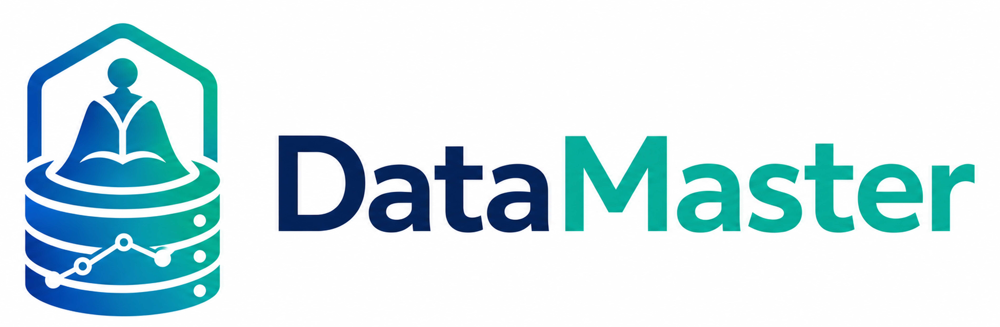
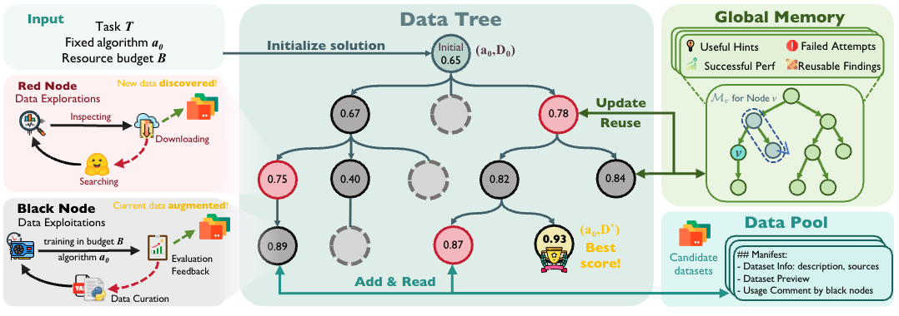

<p align="center">
  
</p>

<p align="center">
  <a href="LICENSE"></a>
  
  <a href="https://arxiv.org/abs/2605.10906"></a>
</p>

<p align="center">
  中文 | <a href="README.md">English</a>
</p>

# DataMaster: Towards Autonomous Data Engineering for Machine Learning

---

<p align="center">
  
</p>

---

## 📖 项目概览

DataMaster 聚焦于机器学习问题中的数据侧优化。在固定建模算法或初始方案的前提下，自动搜索更优的数据流水线、外部数据源、特征变换、验证信号以及可复用的数据工件。框架同时面向 MLE-Bench（竞赛式机器学习任务）和 PostTrainBench（后训练增强任务，如数学推理、领域微调等）。

框架通过 DataTree（数据树）组织数据工程决策：红节点探索潜在有用的外部数据或数据变换，黑节点利用和优化已选候选对象，Data Pool（候选数据池）存储可复用的候选数据集，Global Memory（全局记忆）保存可供后续搜索轮次参考的结果。下游验证反馈用于决定哪些数据侧变更值得进一步扩展。DataMaster 构建于 EvoMaster 之上：https://github.com/sjtu-sai-agents/EvoMaster

---

## 📦 发布范围

DataMaster 同时面向 **MLE-Bench** 和 **PostTrainBench** 工作流设计。当前开源版本包含 MLE-Bench 工作流代码：

- DataMaster 核心 DataTree 搜索工作流（`playground/data_master`）
- MLE-Bench 基线工作流（`playground/ml_master`）
- 数据侧搜索工具（`playground/search_dataset_tools`）
- MLE-Bench 集成代码（`mle-bench/`）
- `configs/` 下的 MLE-Bench Lite 任务配置

**PostTrainBench** 支持已纳入 DataMaster 路线图，相关代码将在后续版本中发布。

---

## ✨ 核心特性

- **DataTree 搜索** — 基于树结构的可执行数据状态迭代搜索。
- **红节点** — 外部数据发现与候选数据源获取。
- **黑节点** — 数据清洗、精炼、适配与 DataLoader 构建。
- **Data Pool（候选数据池）** — 跨搜索分支共享的候选数据集层。
- **Global Memory（全局记忆）** — 跨轮次存储节点结果、工件与可复用发现。
- **MLE-Bench & PostTrainBench** — 验证驱动的任务执行与可配置反馈。

---

<p align="center">
  
</p>

---

## 🏗️ 仓库结构

```text
DataMaster/
├── configs/
│   ├── ml_master/              # 基线 Agent 配置
│   └── data_master/            # DataTree 配置 + 75 个任务配置
├── docs/                       # 中英文文档
├── evomaster/                  # EvoMaster 核心组件
├── initial_code/               # 初始代码模板
├── mle-bench/                  # Benchmark 集成与参考工具
├── playground/
│   ├── ml_master/              # MLE-Bench 基线工作流
│   ├── data_master/            # DataTree 主工作流
│   └── search_dataset_tools/   # 数据集搜索与提交工具
├── scripts/                    # 辅助与可视化脚本
├── run.py                      # 命令行入口
├── pyproject.toml
├── requirements.txt
└── LICENSE
```

---

## 💿 安装

```bash
git clone https://github.com/zhifan-zhou/DataMaster.git
cd DataMaster
python -m venv .venv
source .venv/bin/activate
python -m pip install --upgrade pip
python -m pip install -e .
```

如果你的环境不需要完整的 benchmark 依赖栈，可以先安装包元数据，再按需添加任务特定依赖：

```bash
python -m pip install -e . --no-deps
python -m pip install -r requirements.txt
```

---

## ⚙️ 配置说明

DataMaster 配置文件位于 `configs/ml_master/` 和 `configs/data_master/`。任务特定的 MLE-Bench Lite YAML 配置位于 `configs/data_master/yaml_configs/`，配套的 MCP 工具配置位于 `configs/data_master/json_configs/`。

本仓库不包含任何凭据。请通过环境变量或本地未跟踪的配置文件提供密钥和私有端点。常用环境变量包括：

```bash
export DATA_ROOT=/path/to/mle-bench-lite
export MLE_BENCH_DATA_DIR="$DATA_ROOT"
export LLM_MODEL=your-model-name
export LLM_API_KEY=your-api-key
export LLM_BASE_URL=https://your-llm-endpoint/v1
export SERPER_API_KEY=optional-serper-key
export HF_TOKEN=optional-huggingface-token
```

---

## 🚀 快速开始

准备本地 MLE-Bench 或 MLE-Bench Lite 任务目录，然后使用任务特定配置运行 DataTree 工作流：

```bash
export DATA_ROOT=/path/to/mle-bench-lite
export MLE_BENCH_DATA_DIR="$DATA_ROOT"
export LLM_MODEL=your-model-name
export LLM_API_KEY=your-api-key
export LLM_BASE_URL=https://your-llm-endpoint/v1

python run.py \
  --agent data_master \
  --config configs/data_master/yaml_configs/detecting-insults-in-social-commentary/config_detecting-insults-in-social-commentary.yaml \
  --task "$DATA_ROOT/detecting-insults-in-social-commentary/prepared/public/description.md"
```

使用 `--initial-code` 为初始节点提供种子方案：

```bash
python run.py \
  --agent data_master \
  --config configs/data_master/yaml_configs/detecting-insults-in-social-commentary/config_detecting-insults-in-social-commentary.yaml \
  --task "$DATA_ROOT/detecting-insults-in-social-commentary/prepared/public/description.md" \
  --initial-code initial_code/data_loader_format/detecting-insults-in-social-commentary/full_code.py
```

---

## 📜 主要脚本

- `run.py`：DataMaster 和 EvoMaster Playground 的命令行入口。
- `scripts/auto_config_exp.py`：用于生成任务特定 DataMaster 配置的辅助脚本。
- `scripts/build_full_initial_codes.py`：用于组装初始代码清单的辅助脚本。
- `scripts/prefetch_models.py`：可选的本地模型预取辅助脚本。
- `scripts/check_port_conflicts.py`：用于诊断本地评分服务器端口冲突的工具。
- `scripts/vis_node_by_tree_with_grade.py`：带评分反馈的 DataTree 交互式可视化工具。

---

## 🧪 MLE-Bench 环境准备

本仓库不包含 MLE-Bench 数据集、Kaggle 竞赛数据、生成的提交文件、模型检查点或运行产物。使用者需单独准备 MLE-Bench 或 MLE-Bench Lite 环境，并将 `DATA_ROOT` 或 `MLE_BENCH_DATA_DIR` 指向本地 benchmark 目录。`mle-bench/` 目录保留了 benchmark 集成代码和参考工具。

---

## 🗺️ 路线图

| 项目 | 状态 |
|---|---|
| MLE-Bench / MLE-Bench Lite 工作流 | 已发布 |
| PostTrainBench 工作流 | 即将发布 |
| 补充文档与示例 | 进行中 |
| 可复现性脚本与基准测试 | 计划中 |

---

## 🔒 安全说明

本仓库不会有意包含任何凭据。请勿提交 API 密钥、token、webhook、SSH 密钥、`.env` 文件、benchmark 数据、生成的提交文件、模型检查点、运行日志或私有服务配置。请使用环境变量或本地未跟踪的配置文件管理密钥和部署相关路径。

---

## 📝 引用

如果您在研究中使用了 DataMaster，请引用：

```bibtex
@article{zhou2025datamaster,
  title={DataMaster: Towards Autonomous Data Engineering for Machine Learning},
  author={Zhou, Zhifan and ...},
  journal={arXiv preprint arXiv:2605.10906},
  year={2025}
}
```

> **注意：** 完整作者列表将在论文正式发表后确定。请查看 [arXiv 页面](https://arxiv.org/abs/2605.10906) 获取最新版本。

---

## 🙏 致谢

DataMaster 构建于 EvoMaster 之上，复用了 EvoMaster 的核心 Agent 和运行时抽象。感谢 EvoMaster 项目提供的上游框架支持：https://github.com/sjtu-sai-agents/EvoMaster

---

## 📄 License

本仓库基于 Apache License 2.0 发布。详见 `LICENSE` 文件。
