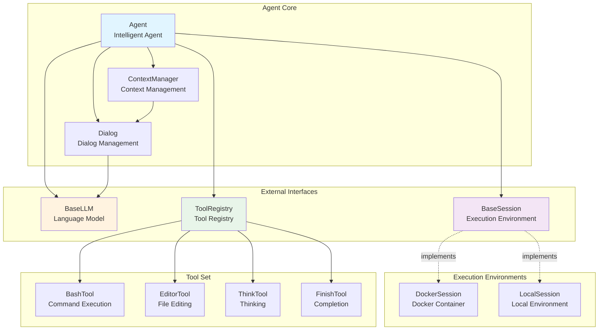
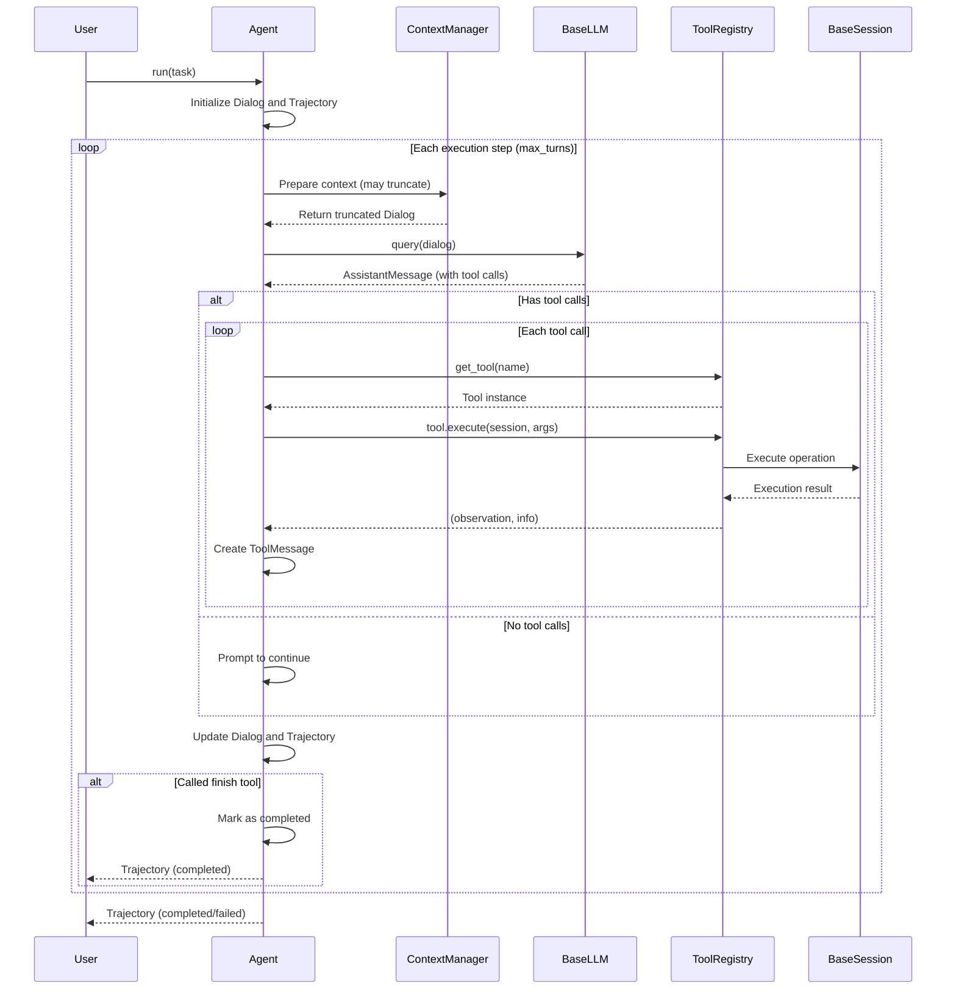
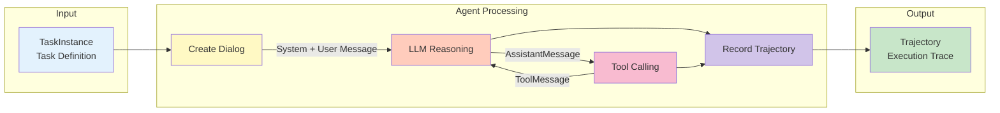

# EvoMaster Agent Module

## Overview

The Agent module is EvoMaster's intelligent agent core, responsible for task execution, tool calling, dialog management, and trajectory recording.

## Architecture

### File Structure

```
agent/
├── agent.py          # Agent base class and standard implementation
├── context.py        # Context management (truncation, compression)
├── session/          # Environment sessions (interaction with Env)
│   ├── base.py       # Session abstract interface
│   ├── local.py      # Local session implementation
│   └── docker.py     # Docker isolated environment implementation
└── tools/            # Tool system
    ├── base.py       # Tool base class and registry
    ├── builtin/      # Built-in tools
    │   ├── bash.py   # Bash command execution
    │   ├── editor.py # File editing tool
    │   ├── think.py  # Thinking tool
    │   └── finish.py # Task completion signal
    ├── mcp/          # MCP tool integration
    │   ├── mcp.py
    │   ├── mcp_connection.py
    │   └── mcp_manager.py
    ├── skill.py      # Skill tool
    └── openclaw_bridge.py  # OpenClaw TypeScript bridge
```

### Architecture Diagram



### Execution Flow



### Data Flow



## Core Components

### 1. Agent Class

**BaseAgent**: Abstract base class defining the core execution flow:
- Dialog management
- Trajectory recording
- Tool call execution
- Context management

**Agent**: Standard implementation with configurable system prompts:
- Inherits from BaseAgent
- Supports custom `system_prompt`
- Ready to use out of the box

#### Initialization Parameters

```python
Agent(
    llm: BaseLLM,              # LLM instance (required)
    session: BaseSession,      # Environment session (required)
    tools: ToolRegistry,       # Tool registry (required)
    system_prompt: str = None, # Custom system prompt (optional)
    config: AgentConfig = None # Agent configuration (optional)
)
```

#### AgentConfig

```python
AgentConfig(
    max_turns: int = 100,                    # Maximum execution turns
    context_config: ContextConfig = None     # Context management config
)
```

### 2. Type System (utils/types.py)

#### Message Types
- **SystemMessage**: System prompt
- **UserMessage**: User input
- **AssistantMessage**: Assistant response (may include tool calls)
- **ToolMessage**: Tool execution result

#### Dialog
Dialog manager maintaining a message list and tool specifications:
```python
dialog = Dialog(
    messages=[...],      # Message list
    tools=[...]          # Tool specification list
)
```

#### Trajectory
Execution trajectory recording the complete agent execution:
```python
trajectory = Trajectory(
    task_id: str,        # Task ID
    status: str,         # Status: running/completed/failed
    dialogs: list,       # Dialog list
    steps: list,         # Step records
)
```

#### TaskInstance
Task definition:
```python
task = TaskInstance(
    task_id: str,            # Task ID
    task_type: str,          # Task type
    description: str,        # Task description
    input_data: str = "",    # Additional input data
)
```

### 3. Session (session/)

Session is the interface between Agent and execution environment, responsible for:
- Executing bash commands
- File operations (upload, download)
- Environment isolation

#### BaseSession
Abstract interface defining standard methods:
- `execute_bash(command: str) -> tuple[str, int]`
- `upload_file(local_path: str, remote_path: str)`
- `download_file(remote_path: str, local_path: str)`

#### DockerSession
Docker-based isolated environment implementation:
```python
session = DockerSession(DockerSessionConfig(
    image="python:3.11-slim",      # Docker image
    working_dir="/workspace",      # Working directory
    memory_limit="4g",             # Memory limit
    cpu_limit=2.0,                 # CPU limit
))
```

### 4. Tools (tools/)

The tool system uses a registration mechanism supporting dynamic tool addition.

#### BaseTool
Base class for all tools:
```python
class MyTool(BaseTool):
    name = "my_tool"

    def execute(self, session: BaseSession, args_json: str) -> tuple[str, dict]:
        # Execution logic
        return observation, info
```

#### Built-in Tools
- **BashTool** (`execute_bash`): Execute bash commands
- **EditorTool** (`str_replace_editor`): File viewing and editing
- **ThinkTool** (`think`): Thinking tool (does not affect environment)
- **FinishTool** (`finish`): Task completion signal

#### ToolRegistry
Tool registration center:
```python
# Create default tool set
tools = create_default_registry()

# Register custom tool
tools.register(MyTool())

# Get tool
tool = tools.get_tool("my_tool")
```

### 5. Context Manager (context.py)

Manages dialog context to prevent exceeding LLM token limits.

#### ContextConfig
```python
ContextConfig(
    max_tokens: int = 128000,                    # Maximum token count
    truncation_strategy: str = "latest_half",    # Truncation strategy
    token_counter: TokenCounter = None           # Token counter
)
```

#### Truncation Strategies
- **NONE**: No truncation
- **LATEST_HALF**: Keep the latest half of messages
- **SLIDING_WINDOW**: Sliding window
- **SUMMARY**: Summary compression (to be implemented)

## Usage

### Basic Usage

```python
from evomaster import (
    Agent,
    create_llm,
    LLMConfig,
    DockerSession,
    DockerSessionConfig,
    create_default_registry,
    TaskInstance,
)

# 1. Create LLM
llm = create_llm(LLMConfig(
    provider="openai",
    model="gpt-4",
))

# 2. Create Session
session = DockerSession(DockerSessionConfig(
    image="python:3.11-slim",
))

# 3. Create Agent
agent = Agent(
    llm=llm,
    session=session,
    tools=create_default_registry(),
)

# 4. Define task
task = TaskInstance(
    task_id="task-001",
    task_type="coding",
    description="Write a Python function to calculate factorial",
)

# 5. Execute task
with session:
    trajectory = agent.run(task)

# 6. View results
print(f"Status: {trajectory.status}")
print(f"Steps: {len(trajectory.steps)}")
```

### Custom System Prompt

```python
custom_prompt = """You are an expert Python programmer.
Your goal is to write clean, efficient, and well-documented code.
Always include docstrings and type hints.
"""

agent = Agent(
    llm=llm,
    session=session,
    tools=create_default_registry(),
    system_prompt=custom_prompt,
)
```

### Custom Agent

For more control, inherit from BaseAgent:

```python
from evomaster.agent import BaseAgent, AgentConfig

class MyAgent(BaseAgent):
    def _get_system_prompt(self) -> str:
        return "My custom system prompt"

    def _get_user_prompt(self, task: TaskInstance) -> str:
        return f"Task: {task.description}"

    def _step(self) -> bool:
        should_finish = super()._step()
        # Add custom logic
        return should_finish
```

### Custom Tool

```python
from evomaster.agent.tools import BaseTool, BaseToolParams

# 1. Define parameter class
class MyToolParams(BaseToolParams):
    name = "my_tool"
    """My custom tool description"""

    param1: str
    param2: int = 0

# 2. Implement tool
class MyTool(BaseTool):
    name = "my_tool"
    params_class = MyToolParams

    def execute(self, session, args_json):
        params = self.parse_params(args_json)
        result = f"Processed {params.param1} with {params.param2}"
        return result, {"success": True}

# 3. Register tool
tools = create_default_registry()
tools.register(MyTool())

# 4. Use
agent = Agent(llm=llm, session=session, tools=tools)
```

## Execution Flow

The Agent execution flow is as follows:

```
1. Initialization (run)
   ├── Create Trajectory
   ├── Create initial Dialog (system + user message)
   └── Set tool specifications

2. Loop execution (_step)
   ├── Prepare context (may truncate)
   ├── Query LLM
   ├── Get AssistantMessage
   │   ├── If no tool calls → prompt to continue
   │   └── If has tool calls → execute each one
   ├── Execute tools
   │   ├── Get tool instance
   │   ├── Call tool.execute(session, args)
   │   └── Generate ToolMessage
   ├── Update Dialog
   ├── Record StepRecord
   └── Check if completed (finish tool)

3. End
   ├── Mark status (completed/failed)
   └── Return Trajectory
```

## Configuration Recommendations

### Development Environment
```python
agent = Agent(
    llm=create_llm(LLMConfig(
        provider="openai",
        model="gpt-4-turbo",
        temperature=0.7,
    )),
    session=DockerSession(DockerSessionConfig(
        image="python:3.11-slim",
        memory_limit="2g",
    )),
    tools=create_default_registry(),
    config=AgentConfig(
        max_turns=50,  # Fewer turns for quick debugging
    ),
)
```

### Production Environment
```python
agent = Agent(
    llm=create_llm(LLMConfig(
        provider="anthropic",
        model="claude-3-5-sonnet-20241022",
        temperature=0.5,
        max_retries=5,
    )),
    session=DockerSession(DockerSessionConfig(
        image="my-custom-image:latest",
        memory_limit="8g",
        cpu_limit=4.0,
    )),
    tools=tools,
    config=AgentConfig(
        max_turns=200,
        context_config=ContextConfig(
            max_tokens=180000,
            truncation_strategy="latest_half",
        ),
    ),
)
```

## Extension Points

### 1. Custom Session
Implement the `BaseSession` interface to support new execution environments:
- Remote server
- Kubernetes Pod
- Local process
- ...

### 2. Custom Tool
Implement the `BaseTool` interface to add new capabilities:
- Database queries
- API calls
- File system operations
- ...

### 3. Custom Context Strategy
Implement new truncation strategies for `ContextManager`:
- Importance-based retention
- Summary compression
- Vector retrieval
- ...

### 4. Custom Agent Logic
Inherit from `BaseAgent` to implement domain-specific agents:
- Scientific experiment Agent
- Code refactoring Agent
- Data analysis Agent
- ...

## Important Notes

1. **Session Management**: Always use `with session:` to ensure proper resource cleanup
2. **Token Limits**: Configure `ContextConfig.max_tokens` appropriately to avoid exceeding LLM limits
3. **Tool Safety**: BashTool can execute arbitrary commands; production environments need security controls
4. **Error Handling**: Agent execution failures raise exceptions that should be caught appropriately
5. **Logging**: Agent uses Python logging; configure it to view detailed logs

## Development Status

Based on the project design, the following features are tracked:
1. Basic Agent implementation -- done
2. LLM interface abstraction -- done
3. Configuration system -- done
4. MCP tool integration -- done
5. Skill system integration -- done
6. Advanced context management (summary compression, long-term memory) -- planned
7. Env cluster management -- planned

## References

- **LLM Documentation**: `evomaster/utils/README.md`
- **Project Design**: `CLAUDE.md`
